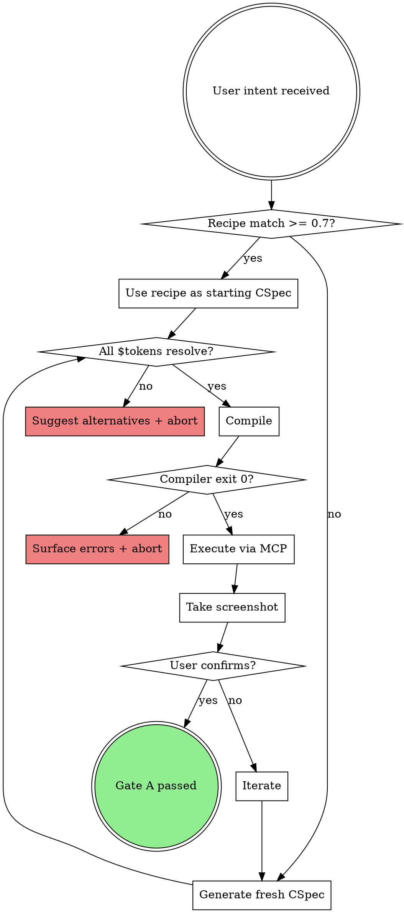

# Verification Gates

> Shared by every action skill. Each gate is a hard requirement: no
> rationalization excuses. See `red-flags-catalog.md` for the
> counter-responses to the common excuses.

---

## Gate A — Compile Gate

**When:** Before any Figma Plugin API execution (i.e. before `figma_execute`
/ `use_figma`).

**Checks:**
- The compiler ran to completion with exit code 0.
- No hardcoded primitives in the scene graph JSON (no raw hex, px, rgb,
  or font-family strings outside `$token` references).
- All `$token` references resolve against the knowledge base registries.

**Evidence required in-conversation:**
- Compiler stdout/stderr showing success.
- The scene graph JSON (or its diff) produced by Claude.

**Applies to:** `generating-figma-design`, `learning-from-corrections`
(when it re-compiles after a correction).

---

## Gate B — Visual Gate

**When:** After any Figma execution, before claiming any work is "done"
or "ready to ship".

**Checks:**
- A screenshot was taken in the current turn (not a recollection from a
  previous turn or a previous session).
- The screenshot is visually consistent with the spec intent (Claude
  describes what it sees; user confirms).
- The user has explicitly confirmed correctness ("done", "ship it", or
  equivalent) — passive silence does not satisfy the gate.

**Evidence required in-conversation:**
- Fresh screenshot tool result.
- User confirmation text.

**Applies to:** `shipping-and-archiving` (mandatory), `generating-figma-design`
(end of each iteration).

---

## Per-action gate requirements

| Action skill                  | Gate A | Gate B |
| ----------------------------- | ------ | ------ |
| `generating-figma-design`     | ✅     | ✅     |
| `learning-from-corrections`   | ✅ (if recompiling) | ✅ (after re-execute) |
| `shipping-and-archiving`      | —      | ✅     |
| `extracting-design-system`    | —      | —      |

---

## Skip policy

**Non-skippable (NEVER):**
- Gate A for any skill that compiles.
- Gate B before claiming done.
- User confirmation before compilation.

**Skippable with warning (logged in `specs/active/{name}.skip.log`):**
- Recipe matching.
- Screenshot reference analysis (visual consistency beyond "it looks
  right").
- Individual CSpec acceptance criteria.

When skipping:
1. Warn the user explicitly about the quality impact.
2. Log the skip reason.
3. Surface as an advisory issue in the next `fix` cycle.

See `red-flags-catalog.md` for rationalizations and counter-responses.

---

## Evidence Discipline

Every "done" claim must be backed by **fresh tool output from this turn**. Memory and intuition do not count as evidence.

### Forbidden phrases

These phrases mean STOP — you don't have evidence yet:
- "Looks right" / "looks good"
- "Should pass" / "should work"
- "I'm confident that..."
- "Probably fine"
- "Last time it worked"
- "Tests usually pass here"

### Required evidence per claim

| Claim | Required evidence (this turn) |
|---|---|
| "The compiler ran" | `bridge-ds compile ...` exit code 0 in this conversation |
| "The Figma output looks right" | Screenshot from `figma_take_screenshot` taken in this conversation |
| "Tests pass" | `npm test` output captured in this conversation |
| "The token exists" | `grep` or `Read` of the registry file in this conversation |
| "The cron PR opens correctly" | The actual PR URL or `gh pr view` output |
| "The KB is fresh" | `git log --oneline -1 knowledge-base/registries/` in this turn |

### Rationalization → Reality

| Rationalization | Reality |
|---|---|
| "I just ran it 2 turns ago, no need to re-run" | State changes between turns. Re-run. |
| "The diff is so small, of course it'll pass" | Small diffs cause big failures. Run the test. |
| "Showing the output is verbose, the user trusts me" | The user trusts evidence, not assertions. Show the output. |
| "I remember this passing yesterday" | Yesterday is not now. |
| "The user can run it themselves" | If you claim done, you back it. The user shouldn't have to verify your work. |

### Application across Bridge skills

- **`make`** — never claim CSpec done without compiler exit 0 + Figma screenshot in turn
- **`fix`** — never claim correction integrated without diff output + recipe-patch test passing
- **`done`** — never archive CSpec without final Gate B verification screenshot + recipes-test pass
- **`setup`** — never claim setup complete without `bridge-ds doctor` passing

---

## CSpec generation pipeline (decision flow)

