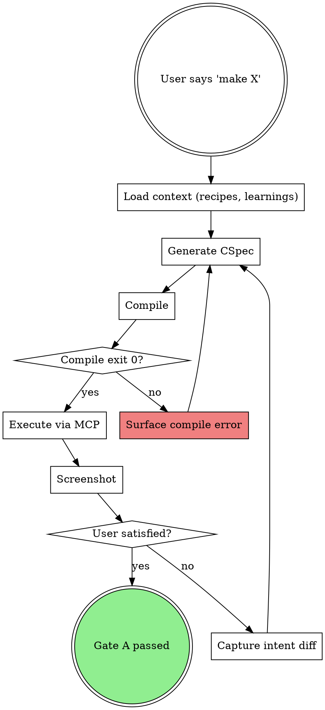

# Generating Figma Design

## Overview

Unified `make` flow: CSpec → scene graph → compiler → Figma execute → screenshot → verify. Replaces the legacy `spec → design → review` cycle with a single compiler-driven action. All tokens resolve against the knowledge base; all Figma API rules are enforced by the compiler.

## When to Use

Invoke when the user:
- says `make`, `design`, `create`, `build`, `generate`, or asks for a "new component" / "new screen"
- has already run `setup` (knowledge base exists)
- has an MCP transport available (console or official)

Do NOT use if:
- the user is adjusting an existing design that is already in Figma — use `learning-from-corrections` instead
- the user is archiving or shipping — use `shipping-and-archiving`
- the knowledge base is missing — run `extracting-design-system` first

## Procedure

**Before starting, load:**
- `references/compiler-reference.md` (repo-root) — scene graph JSON format and rules
- `references/transport-adapter.md` (repo-root) — transport detection and tool mapping

## Prerequisites

- Knowledge base exists (registries populated) — if not: "Run `setup` first"
- MCP transport available (see `references/transport-adapter.md` (repo-root) Section A)

---

## Phase A — Context (target: 30s)

### A1. Detect transport

Read `references/transport-adapter.md` (repo-root) Section A. Determine console vs official transport.

```
Console: figma_get_status() -> setup.valid: true
Official: whoami() + test use_figma call
```

Report:
```
Transport: {console | official}
```

### A2. Load registry index

Load the **summary** of available DS components — names and types only, not full registry data:

- `registries/components.json` — extract component names, variant property names, and keys
- `registries/variables.json` — extract variable name paths (for token reference validation)
- `registries/text-styles.json` — extract style names (for `$text/` reference validation)
- `registries/icons.json` — extract icon names (if file exists)
- `registries/logos.json` — extract logo names (if file exists)

**Do NOT load guides, patterns, or figma-api-rules.md.** The compiler handles all Figma API rules.

### A3. Load learnings

Load `knowledge-base/learnings.json` (skip if file doesn't exist).

Filter by context matching the user's description:
- Include all **global** learnings (`scope: "global"`)
- Include **contextual** learnings where `context.screenType` or `context.component` matches

### A4. Load recipe index

Load `knowledge-base/recipes/_index.json` (skip if file doesn't exist — no recipes yet).

---

## Phase B — Recipe Match

### B1. Extract archetype

From the user's description, identify:
- **Mode**: component or screen (ask if ambiguous)
- **Archetype**: screen type (settings, dashboard, form, detail, list...) or component type
- **Keywords**: key terms from the description (sidebar, form, table, cards, navigation...)

### B2. Score against recipe index

For each recipe in `_index.json`, compute a match score:

| Dimension | Weight | Method |
|-----------|--------|--------|
| Archetype match | 0.40 | Exact match on `meta.archetype` vs extracted archetype |
| Tag overlap | 0.25 | Jaccard similarity between recipe `tags` and extracted keywords |
| Structural match | 0.20 | Zone count, component types, parameter compatibility |
| Confidence | 0.15 | Recipe's current confidence score |

### B3. Apply match result

| Score | Action |
|-------|--------|
| **>= 0.85** | **Exact match.** Load recipe file, pre-fill CSpec from recipe parameters. Report: "Recipe match: {name} (score: {score}). Using as template." |
| **0.60 -- 0.84** | **Partial match.** Load recipe as scaffold. Report: "Partial recipe match: {name} (score: {score}). Using as starting point, will supplement missing zones." |
| **< 0.60** | **No match.** Proceed from scratch. Report: "No recipe match. Generating from scratch." |

---

## Phase C — CSpec (target: 30-60s)

### C1. Generate CSpec YAML

Choose the appropriate template:
- **Screen mode**: `skills/generating-figma-design/references/templates/screen-cspec.yaml`
- **Component mode**: `skills/generating-figma-design/references/templates/component-cspec.yaml`

Fill the CSpec based on:
- User description (intent, sections, components)
- Recipe template (if match found in Phase B)
- Registry data (available components, tokens, text styles)

**If a recipe was matched (>= 0.60):**
- Start from the recipe's `graph` structure
- Replace `{{ param }}` placeholders with values from the user's description
- Resolve `@lookup:ComponentName` references against the live registry
- Add/remove zones as needed for the specific request

**If no recipe match (from scratch):**
- Build the layout tree node by node using the CSpec template structure
- Reference DS components as INSTANCE nodes (by name — the compiler resolves keys)
- Use `$token` references for all spacing, colors, radius, typography
- Use REPEAT nodes for lists/grids with repeated structure

### C2. Apply learnings

Integrate learnings from A3 into the CSpec:
- **Global learnings** (`scope: "global"`): auto-apply — replace default token values with learned preferences
- **Contextual learnings** (`scope: "contextual"`): suggest — note in comments, apply if context matches

Report applied learnings:
```
LEARNINGS APPLIED ({n}):
- {rule} (signals: {n}, scope: {scope})
- {rule} (signals: {n}, scope: {scope})
```

### C3. Detect new DS components (screen mode only)

For each UI pattern described in the CSpec, check if it exists in the component registry:
- If covered by an existing DS component -> use INSTANCE node
- If NOT covered -> add to `new_components` section of the CSpec

**If new components are identified:**
```
{N} new DS component(s) needed:
1. {name} — {description}

These must be created before this screen. Starting with: {name}
```
-> Trigger a nested `make` flow for each new component. When all are done, resume the screen make.

### C4. Present plan to user

Show a **readable summary** of the CSpec (NOT raw YAML). Format as a plan tree:

```
PLAN: {name}
Mode: {screen | component}
Canvas: {1440px (web) | 390px (mobile) | 1024px (tablet)}
Recipe: {recipe name or "from scratch"}
Learnings: {n} applied

STRUCTURE:
  Root ({width}x{height}, {layout direction})
  +-- {Zone 1} ({width}, {layout})
  |   +-- {Component} ({variant})
  |   +-- {Component} ({variant})
  +-- {Zone 2} ({fillH}, {layout})
  |   +-- {Section 1}
  |   |   +-- {Component} ({variant})
  |   +-- {Section 2}
  |   |   +-- REPEAT x{n}: {Component}

DS COMPONENTS: {n} instances
TOKENS: {n} references
STATES: {list or "populated only"}

Generate this design?
```

### C5. User validates

Wait for explicit user confirmation. The user can:
- **Approve** -> proceed to Phase D
- **Adjust** -> modify the CSpec based on feedback, re-present plan
- **Cancel** -> abort

### C6. Save CSpec

Save the CSpec YAML to `specs/active/{name}.cspec.yaml`.

---

## Phase D — Compile + Execute

### D1. Convert CSpec to scene graph JSON

Transform the CSpec's `layout` tree into the scene graph JSON format defined in `references/compiler-reference.md` (repo-root):

- CSpec `layout` nodes map directly to scene graph `nodes`
- All `$token` references are preserved (the compiler resolves them)
- Component names in INSTANCE nodes are preserved (the compiler resolves keys)
- REPEAT and CONDITIONAL nodes pass through to the compiler

Add the root wrapper:
```json
{
  "version": "3.0",
  "metadata": {
    "name": "{CSpec meta.name}",
    "width": {CSpec meta.width},
    "height": {CSpec meta.height},
    "transport": "{detected transport}",
    "fileKey": "{user's file key}"
  },
  "fonts": [ ... ],
  "nodes": [ ... ]
}
```

**Font list:** Collect all unique font families and styles referenced by `$text/` tokens in the scene graph. Cross-reference against `registries/text-styles.json` to get actual font family + style values.

### D2. Write scene graph to temp file

```bash
# Write JSON to temp file
cat > /tmp/bridge-scene-{name}.json << 'EOF'
{ ... scene graph JSON ... }
EOF
```

### D3. Run the compiler

```bash
bridge-ds compile \
  --input /tmp/bridge-scene-{name}.json \
  --kb {kb-path} \
  --transport {console|official}
```

The compiler outputs a JSON array of `{ id, code, description }` chunks to stdout.

### D4. Handle compiler errors

If the compiler returns errors to stderr:

1. Read the error messages and suggestions
2. Fix the scene graph JSON based on the suggestions (see `references/compiler-reference.md` (repo-root) Section 8 for common errors)
3. Re-write the temp file and re-run the compiler
4. **Maximum 3 attempts.** If still failing after 3, report errors to user and ask for guidance.

### D5. Execute chunks in Figma

For each output chunk from the compiler:

**Console transport:**
```
figma_execute({ code: "{chunk.code}" })
```

**Official transport:**
```
use_figma({
  fileKey: "{fileKey}",
  description: "{chunk.description}",
  code: "{chunk.code}"
})
```

Execute chunks sequentially. If a chunk fails:
1. Read the error
2. Report to user
3. Attempt fix if the error is clear (e.g., font not loaded, component not found)

### D6. Take screenshot

Take a screenshot **AFTER the final chunk** (not after each chunk):

```
Console: figma_take_screenshot({ node_id: "{rootNodeId}", file_key: "{fileKey}" })
Official: get_screenshot({ nodeId: "{rootNodeId}", fileKey: "{fileKey}" })
```

### D7. Save snapshot

Save a snapshot of the design's node tree for future `fix` diffing.

Run a node tree extraction script via `figma_execute` (or `use_figma`), using the root node ID from D5.

Save to `specs/active/{name}-snapshot.json`:
```json
{
  "meta": {
    "spec": "{name}",
    "generatedAt": "{ISO timestamp}",
    "rootNodeId": "{rootId}",
    "fileKey": "{fileKey}",
    "recipe": "{recipe ID or null}",
    "learningsApplied": ["{learning IDs}"]
  },
  "tree": { ... extracted node tree ... }
}
```

---

## Phase E — Present

### E1. Show screenshot

Display the screenshot taken in D6.

### E2. Report

```
Design compiled and executed.

File: {figma_url}
Created:
  - {n} component instances
  - {n} bound variables (colors + spacing + radius)
  - {n} learnings applied
  - Recipe: {recipe name or "from scratch"}
  - Chunks: {n} executed

Warnings:
  - {any issues}
```

### E3. Offer next step

```
Looks good? Options:
  - Describe changes -> I'll modify and recompile
  - "I adjusted in Figma" -> triggers fix flow
  - "done" / "ship it" -> triggers done flow
```

---

## Iteration Loop

### User describes changes (in conversation)

1. Identify which parts of the scene graph need modification
2. Update the scene graph JSON (modify affected nodes only)
3. Re-write temp file
4. Re-run the compiler
5. Execute **only the affected chunks** (not the entire design)
6. Take new screenshot
7. Update snapshot
8. Present result and offer next step again

### User says "I adjusted in Figma"

Trigger the `fix` flow via the `learning-from-corrections` skill.

### User says "done" / "ship it"

Trigger the `done` flow via the `shipping-and-archiving` skill.

---

## Target Turn Budget

| Turn | Action |
|------|--------|
| 1 | Phase A (context load) + Phase B (recipe match) |
| 2 | Phase C (CSpec generation, present plan to user) |
| 3 | *User confirms or adjusts* |
| 4 | Phase D (compile + execute all chunks) |
| 5 | Phase E (screenshot, report, offer next step) |
| 6+ | Iteration loop (if changes requested) |

**Target: 5 turns for a first-pass generation.** Each iteration adds 2-3 turns.

---

## Compiler vs Raw Scripts

In v3, Claude NEVER writes raw Figma Plugin API scripts. The workflow is:

```
Claude produces scene graph JSON
  -> Compiler resolves tokens, validates structure, generates code
  -> Code chunks are executed via MCP

NOT:
  Claude writes figma_execute scripts directly
```

This means:
- No need to load `figma-api-rules.md`
- No need to remember FILL-after-appendChild, resize-before-sizing, etc.
- No pre-script element audits (the compiler validates against registries)
- No script line counting or splitting logic
- Errors are caught by the compiler with actionable suggestions

The only time Claude touches raw Plugin API code is:
1. Snapshot extraction scripts (small, standardized)
2. Emergency fixes when the compiler cannot handle an edge case (rare)

<HARD-GATE>
Every Figma execution MUST pass Gate A (compile) before execute and
Gate B (visual) before claiming the iteration is complete. See
`references/verification-gates.md` (repo-root).

NEVER write raw Figma Plugin API code. All scene graphs go through
`lib/compiler/compile.ts` (shipped as `bridge-ds compile`).

NEVER use hardcoded primitive values in the scene graph. Only
`$token` references.
</HARD-GATE>

## Red Flags

See the full catalog at `references/red-flags-catalog.md` (repo-root).

Top flags for this skill:
- "I'll hardcode this hex once, it's faster" → **Always use a semantic token.**
- "The compiler is overkill for this tiny thing" → **The compiler is the only path.**
- "I remember this nodeId from my last session" → **NodeIds are session-scoped, re-search.**

## Verification

This skill is gated by `references/verification-gates.md` (repo-root):

- **Gate A (Compile)** — mandatory before any `figma_execute` / `use_figma`.
- **Gate B (Visual)** — mandatory at the end of each iteration. Fresh screenshot in this turn + user confirmation.

Evidence to surface: compiler stdout, scene graph JSON, screenshot tool result, user confirmation text.

## Skill-specific references

- `./references/templates/component-cspec.yaml` — CSpec template for components
- `./references/templates/screen-cspec.yaml` — CSpec template for screens

---

## The make flow (decision diagram)


