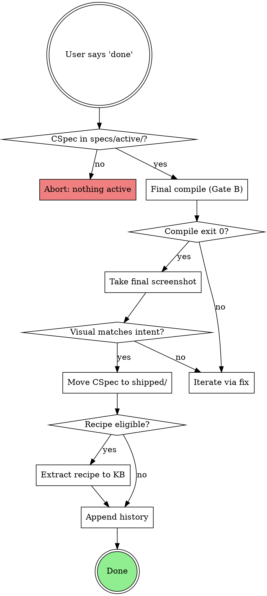

# Shipping And Archiving

## Overview

Formal completion of a design session. Verifies visual correctness one last time (Gate B), moves the CSpec to `specs/shipped/`, appends a history entry, and — when the design qualifies — extracts a reusable recipe back into the knowledge base.

## When to Use

Invoke when the user:
- says "done", "ship it", "ship", "finish", "complete", "archive"
- has an active CSpec with a snapshot

Do NOT use if:
- the user is still iterating — use `generating-figma-design` or `learning-from-corrections`
- the user is abandoning the work — route to `drop` (handled by `using-bridge` command map)

## Procedure

### 1. Auto-detect pending corrections

Check if the snapshot has been updated since the last `fix` run, or if `fix` was never run:

- If snapshot exists (`specs/active/{name}-snapshot.json`) AND no learnings reference this spec in `learnings.json`:
  - Re-extract current Figma state (same extraction as the `learning-from-corrections` skill, step 2)
  - Compare against snapshot
  - If changes detected:
    ```
    Changes detected since last generation/fix.
    Running auto-fix to capture corrections before archiving...
    ```
    -> Execute the full fix flow via the `learning-from-corrections` skill (steps 2-10 of its procedure)
  - If no changes: proceed

- If no snapshot exists: skip (design was never generated, spec-only work)

### 2. Final check

- [ ] CSpec exists in `specs/active/`
- [ ] User has validated the design (explicit confirmation)
- [ ] If Figma design exists: matches CSpec intent

### 3. Recipe extraction check

Evaluate if this design qualifies for recipe extraction:

**Eligibility criteria (ALL must be met):**
1. The CSpec is in **screen mode** (`meta.type: screen`)
2. The design was generated and executed in Figma (snapshot exists)
3. Total corrections during the `fix` cycle <= 2

**If eligible:**
```
This design qualifies for recipe extraction.
Creating recipe: {archetype} (from {name})
```

Extract recipe:
1. Take the final scene graph JSON (post-corrections)
2. Templatize: replace concrete text content with `{{ param }}` placeholders
3. Replace component keys with `@lookup:ComponentName` references
4. Define parameters based on variable content (title, items, section count, etc.)
5. Set initial confidence: `0.70 + (0.05 * 1) = 0.75` (first success)
6. Write to `recipes/r-{archetype}-{nnn}.json`
7. Update `recipes/_index.json` with the new recipe metadata

**If not eligible:**
```
Recipe extraction skipped: {reason}
  (screen mode: {yes/no}, corrections: {n}, threshold: <= 2)
```

### 4. Update recipe confidence (if recipe was used)

If a recipe was used during `make` (check `snapshot.meta.recipe`):

1. Increment `successCount`
2. Recalculate confidence:
   ```
   base_score = min(1.0, 0.70 + (successCount * 0.05))
   recency_weight = max(0.50, 1.0 - (days_since_last_use * 0.005))
   correction_decay = max(0.60, 1.0 - (avgCorrections * 0.15))
   confidence = base_score * recency_weight * correction_decay
   ```
3. Update the recipe file and `_index.json`

### 5. Archive

```bash
mv specs/active/{name}.cspec.yaml specs/shipped/{name}.cspec.yaml
```

If a snapshot exists:
```bash
mv specs/active/{name}-snapshot.json specs/shipped/{name}-snapshot.json
```

### 6. Update history log

Append to `specs/history.log`:

```
{date} | {name} | {component|screen} | {figma_url} | {learnings_count} | {recipe_extracted: yes/no}
```

### 7. Persist learnings summary

Report learnings from this cycle:
```
Learnings persisted: {n} learnings, {n} flags from this design.
{n} recipe(s) updated, {n} recipe(s) created.
```

### 8. Brief retro

- **What went well?** (patterns to repeat)
- **What was friction?** (improvements for the workflow)
- **What was learned?** (reusable knowledge captured in learnings.json)

### 9. Cleanup

- Delete temp files: `/tmp/bridge-scene-{name}.json` (if exists)
- Confirm no stale files remain in `specs/active/`

---

## Output

```
## Done: {name}

Figma: {url}
CSpec archived: specs/shipped/{name}.cspec.yaml
Learnings: {n} persisted
Recipe: {extracted as r-{archetype}-{nnn} | updated {recipe} confidence to {score} | none}

Ready for the next design!
```

<HARD-GATE>
NEVER archive a spec without Gate B evidence from the current or
previous turn (fresh screenshot + explicit user confirmation).

NEVER claim "shipped" without the history.log entry being written.
</HARD-GATE>

## Red Flags

See the full catalog at `references/red-flags-catalog.md` (repo-root).

Top flags for this skill:
- "User said 'nice', I'll mark it done" → **Confirmation must be explicit (`done`, `ship it`).**
- "I'll skip the recipe extraction, it's a one-off" → **Eligibility is deterministic (screen + ≤2 corrections). Let the check run.**

## Verification

This skill is gated by `references/verification-gates.md` (repo-root):

- **Gate B** — mandatory. Fresh screenshot this turn OR in the immediately
  preceding turn + explicit confirmation text.

Evidence to surface: screenshot tool result, confirmation text, archive
path, recipe extraction decision.

## Hooks into other skills

(No cross-skill invocations in v6. The docs cascade was removed.)

---

## The done gate sequence (decision diagram)


